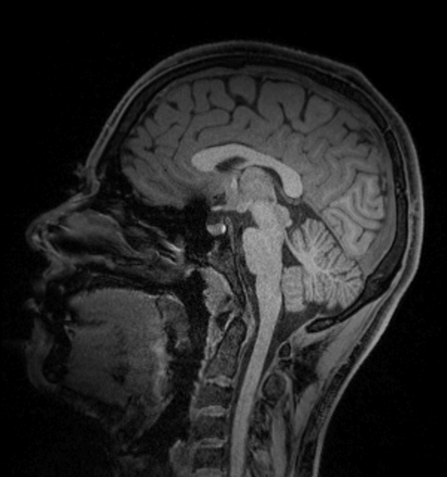

# MyBrain

  

<em>My brain — sagittal T1-weighted MRI</em>

This monorepo keeps the two workflows for this project together while allowing
each to remain independent:

- [`mri-visualizer/`](./mri-visualizer/) — the Next.js application deployed on
  Vercel. Configure Vercel's **Root Directory** as `mri-visualizer`.
- [`brain-3d-print/`](./brain-3d-print/) — the FreeSurfer, FSL, and MeshLab
  workflow and reference assets for producing a printable brain model.

The printing workflow's full instructions are in
[`brain-3d-print/README.md`](./brain-3d-print/README.md).
